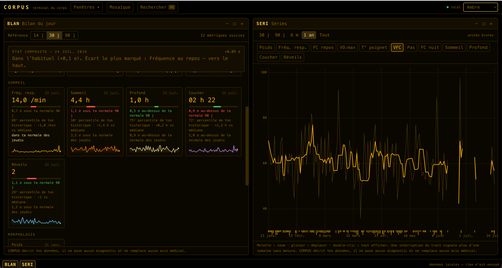

# CORPUS

Terminal d'analyse des séries du corps. Applique la boîte à outils quantitative d'un
terminal financier — z-scores, régimes, corrélations décalées, études d'événement,
lissages exponentiels — au sommeil, à la variabilité cardiaque, au poids, à la charge
d'entraînement et au ressenti.

Tout est local. Aucun compte, aucune synchronisation serveur, aucun appel réseau.



## Installation

Prérequis : [Node.js](https://nodejs.org) 20 ou plus récent.

```bash
git clone https://github.com/ZakiChair/corpus.git
cd corpus
npm install
npm run dev        # → http://localhost:5230
```

Au premier lancement, la fenêtre **DONN** s'ouvre seule : c'est la porte d'entrée.

- **Pour essayer sans données** : « Générer 18 mois » remplit l'application d'un
  historique de démonstration — pas du bruit, un modèle causal simulé (voir plus bas).
- **Avec tes données** : dépose ton `export.zip` Apple Santé (iPhone : Profil →
  Exporter toutes les données), un JSON Health Auto Export, un CSV, ou une sauvegarde
  CORPUS.

```bash
npm run build      # build de production dans dist/
npm run preview    # sert le build en local
npm test           # tests unitaires (Vitest)
npm run test:e2e   # parcours navigateur (Playwright ; npx playwright install chromium la première fois)
```

Servie en production, l'application s'installe en **PWA** (icône dans le Dock,
fonctionne hors ligne). La synchronisation continue et la sauvegarde automatique
utilisent la File System Access API — navigateurs Chromium (Chrome, Edge, Arc).

## Fonctionnalités

**Onze fenêtres à mnémonique**, comme sur un terminal. `⌘K` ouvre la palette, le menu
**Fenêtres** les liste toutes.

| | | |
|---|---|---|
| `BLAN` | Bilan | État composite du jour, une tuile par métrique : valeur, z-score (brut ET conditionné au jour de semaine), rang percentile |
| `SIGN` | Signaux | Ce qui est inhabituel en ce moment : écarts à 2 σ, records, changements de palier, charge hors habitude |
| `SERI` | Séries | Graphe multi-métriques, zoom et panoramique, repères d'événements |
| `LOAD` | Charge | Charge aiguë et chronique, forme, ratio aigu/chronique, monotonie |
| `COMP` | Comparaison | Ce bloc vs le précédent : écart des médianes de toutes les métriques, avec intervalle |
| `CORR` | Corrélations | Matrice décalée : qui précède quoi, et de combien de jours |
| `EVTS` | Événements | Réponse moyenne d'une métrique autour d'un type d'événement |
| `HYPO` | Hypothèses | « Les jours où X est dans son quart bas, que vaut Y le lendemain ? » |
| `SAIS` | Saisie | Saisie manuelle du jour, bornée par le catalogue |
| `ANNO` | Journal | Événements datés : séances, sorties, voyages, maladies |
| `DONN` | Données | Import, synchronisation, sauvegarde, démonstration, effacement |

**Un vrai terminal, pas une collection de pages.**

- Les fenêtres se répondent : une tuile de BLAN, une relation de CORR, une ligne de
  SIGN ou de COMP, un événement d'ANNO ouvrent SERI déjà réglée sur la chose cliquée.
- Le jour survolé dans SERI se trace dans LOAD, et inversement.
- Glisser une fenêtre contre un bord l'ancre — moitié d'écran à gauche/droite, quart
  aux coins, plein écran en haut — et la ré-attraper lui rend sa taille. `⌥←` / `⌥→` /
  `⌥↑` ancrent au clavier, `⌥↓` restaure. Double-clic sur la barre de titre : agrandir.
- Dispositions nommées enregistrables depuis le menu Fenêtres, rappelables à la palette.
- Quatre thèmes : Nuit, Ambre, Phosphore, Clinique.

**Des analyses honnêtes.** Chaque garde-fou existe parce qu'un mensonge statistique
a été rencontré : les z-scores excluent le jour qu'ils jugent, les fenêtres glissantes
sont calendaires, un décalage de corrélation n'est annoncé que si son pic dépasse la
valeur contemporaine, les lignes de base d'étude d'événement mettent en quarantaine les
jours sous l'effet d'une autre occurrence, les écarts de périodes portent un intervalle
bootstrap, et tout le texte généré décrit sans jamais prescrire.

**Les données de l'Apple Watch, en continu.** La montre → Santé sur l'iPhone → un
export automatique (Health Auto Export ou un raccourci planifié) déposé dans iCloud
Drive → CORPUS surveille le dossier et importe les nouveaux fichiers chaque minute.
Et chaque jour, une copie de sauvegarde JSON est écrite dans le dossier de ton choix.

## Ce que ça répond

Les applications de santé grand public affichent des courbes et un score propriétaire.
Elles ne répondent pas aux questions qu'on se pose réellement :

- Mon sommeil de mardi explique-t-il ma variabilité cardiaque de mercredi, ou l'inverse ?
- Combien de jours après une grosse séance ma VFC revient-elle à sa ligne de base ?
- Quel est l'effet moyen d'une soirée arrosée sur ma fréquence au repos — mesuré sur mes
  trente soirées à moi, pas sur une étude clinique ?
- Ma valeur d'aujourd'hui est-elle basse dans l'absolu, ou basse pour un lundi ?

Ce sont des questions d'étude d'événement, de corrélation décalée et de percentile
conditionnel. La finance quantitative les traite depuis quarante ans.

## Import

| Format | État |
|---|---|
| **Apple Santé** | L'`export.zip` tel que l'app le produit (Profil → Exporter toutes les données), ou l'`export.xml` qu'il contient. Lecture en flux avec progression et annulation. |
| **Health Auto Export** | Le JSON de l'app iOS du même nom — c'est le format de la synchronisation continue, accepté aussi en dépôt manuel. |
| CSV | Séparateur, format de date et virgule décimale détectés. Conventions suisses comprises (`26.07.2026`, `74,7`, `12'480`). |
| Profil ATHLOS | Le JSON exporté par ATHLOS. Poids et tour de taille rejoignent le catalogue, les métriques de performance sont conservées telles quelles, les séances deviennent des annotations. |
| Sauvegarde CORPUS | Le JSON exporté depuis `DONN`. Si des données existent déjà, la restauration se confirme — remplacer ou fusionner. |

Les dates ambiguës sont lues **jour avant mois** (convention européenne) : `03/12/2026`
est le 3 décembre.

### Synchronisation continue (Apple Watch « en direct »)

Une app web locale ne peut pas parler à HealthKit ; le chemin vivant passe par un
dossier. Sur l'iPhone, **Health Auto Export** (ou un raccourci planifié) dépose un
export JSON/CSV dans iCloud Drive à intervalle régulier ; le dossier arrive sur le
Mac ; CORPUS le surveille (`DONN` → Synchronisation continue) et importe les
nouveaux fichiers chaque minute. File System Access API — navigateurs Chromium
uniquement. Dans le Finder, garder le dossier en « Toujours conserver sur ce Mac »,
sinon iCloud garde les fichiers dans le nuage et la lecture échoue. Une sauvegarde
CORPUS déposée dans ce dossier n'est jamais appliquée automatiquement.

### Sauvegarde automatique

Depuis `DONN` → Sauvegarder, « Copier chaque jour vers un dossier » écrit une copie JSON
quotidienne (un fichier par jour, rotation sur deux semaines) dans un dossier choisi —
un dossier iCloud Drive donne une sauvegarde hors machine sans aucun serveur. Le fichier
du jour est réécrit toutes les heures.

### Apple Santé — ce qui est vérifié, et ce qui ne l'est pas

Le parseur est testé contre un fixture écrit à la main, contre la lecture d'une archive ZIP
(stockée et deflate), contre un découpage du fichier à des frontières d'octets hostiles —
au milieu d'un attribut, d'un nom de balise, entre le `/` et le `>` — et de bout en bout
dans le navigateur.

Ce que l'import récupère : VFC, fréquence au repos, FC nocturne (le minimum entre minuit
et 8 h, résumé de la fréquence cardiaque instantanée), température du poignet, fréquence
respiratoire, VO₂max estimé, poids, masse grasse, tour de taille, pas, les quatre
métriques de sommeil, les séances, et le profil (naissance, sexe, taille). Les types non
pris en charge sont comptés puis ignorés, et la fenêtre le signale.

Quatre conventions à connaître :

- **Agrégation par métrique.** Les pas sont **sommés** sur la journée, tout le reste est
  **médiané**. Une médiane sur les pas donnerait un chiffre plausible et faux.
- **Les pas se dédoublonnent par source.** iPhone et Apple Watch comptent chacun les
  mêmes pas ; additionner les appareils doublerait la journée. La source la plus fournie
  du jour est retenue — elle peut légèrement sous-estimer, jamais doubler.
- **Une nuit appartient au jour du réveil.** Les segments sont regroupés en sessions (moins
  d'une heure d'écart), la durée est l'**union** des intervalles — sinon une montre et une
  application tierce couvrant la même nuit la compteraient deux fois. Les micro-éveils de
  moins de deux minutes ne comptent pas comme réveils.
- **La masse grasse est ambiguë** : Apple écrit `unit="%"` avec tantôt `15.2`, tantôt
  `0.152`. La décision se prend sur **tout le fichier** — si son maximum est ≤ 1, il est en
  fractions — et jamais enregistrement par enregistrement.

## Structure

```
src/
  core/        temps, métriques, types, séries, stockage, store
  analyse/     stats, alignement, corrélation, charge, événement, régime,
               saisonnalité, ruptures, comparaison, lecture
  donnees/     générateur causal, imports (Apple Santé, Health Auto Export, CSV,
               ATHLOS), lecture ZIP, synchronisation, sauvegarde automatique
  shell/       registre, gestionnaire de fenêtres, intentions, palette, thème
  ui/          domaine d'axe, zoom, jetons canvas, composants partagés
  fenetres/    une par mnémonique
e2e/           parcours Playwright dans le vrai navigateur
```

`IdFenetre` et `IdMetrique` sont **dérivés** de leurs registres via `as const satisfies` :
ajouter une fenêtre sans câbler son composant est une erreur de compilation, pas un écran
blanc découvert à l'exécution.

## Pile

Vite 8, React 19, TypeScript 6, Tailwind 4, Zustand 5, Zod 4, Vitest 4, Playwright. Les
graphes sont en canvas 2D écrit à la main — aucune bibliothèque de charting.

---

CORPUS décrit tes données. Il ne pose aucun diagnostic et ne remplace aucun avis médical.
